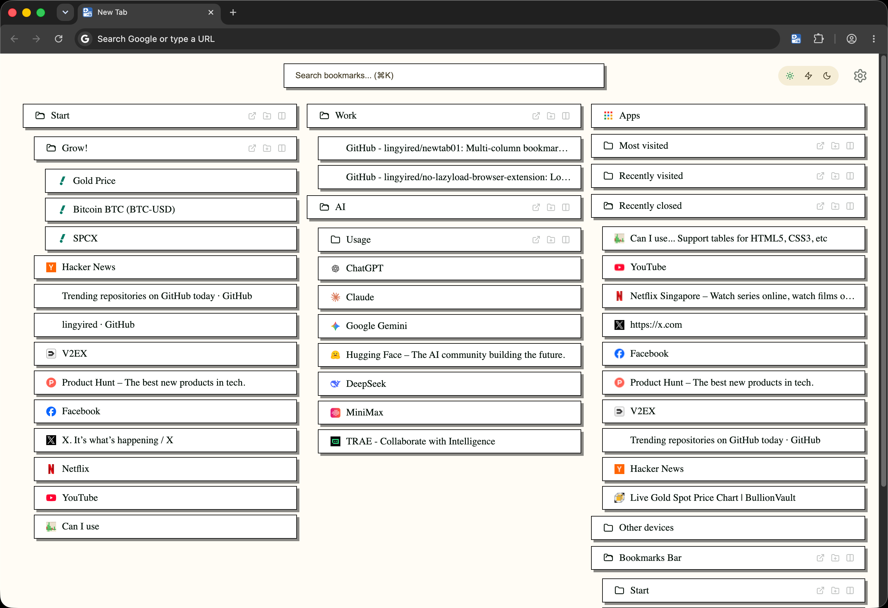
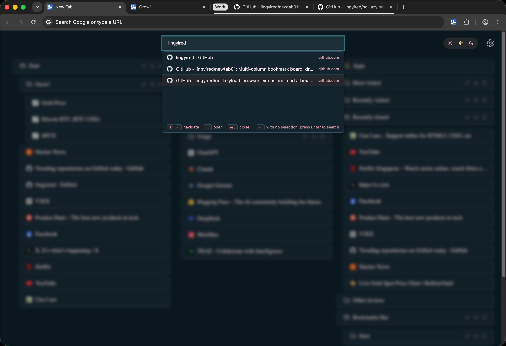

# newtab01

> 一个克制、高性能、支持分屏的 Chrome 新标签页扩展。

[](LICENSE_MIT.txt)
[](manifest.json)
[](https://chromewebstore.google.com/detail/newtab01/nlecfkdndodablijmfcjbnannkgmpegj)
[](#技术栈)
[](#致谢)

[English](../README.md) · [中文](README.zh.md)

---

## 安装

[](https://chromewebstore.google.com/detail/newtab01/nlecfkdndodablijmfcjbnannkgmpegj)

扩展已发布到 Chrome Web Store。点击上方徽章（或用 [这个直链](https://chromewebstore.google.com/detail/newtab01/nlecfkdndodablijmfcjbnannkgmpegj)）安装最新发布版本。Edge Add-ons 上架进行中。

如果想本地加载未压缩版本用于开发，请看下方[开发](#开发)一节。

---

## 简介

**newtab01** 是一个 Chrome 新标签页扩展，把 Chrome 默认的新标签页替换成一个多列的书签板。

- **多列书签板** —— 支持拖拽排序、特殊文件夹（书签栏 / Top Sites / 最近关闭 / Apps）
- **文件夹批量操作** —— 批量打开、打开为 Chrome 标签组、整个文件夹丢进分屏视图
- **书签模糊搜索** —— `⌘` / `Ctrl + K` 唤起（fuse.js，标题 + URL，权重 0.7 / 0.3）
- **Popup 分屏** —— 从书签或已打开的标签里挑 2–4 个 URL，拼成 iframe 分屏视图（`2h` / `2v` / `3H` / `4grid`）
- **12 套内置主题** 全部来自 [tweakcn](https://tweakcn.com)，**无限运行时导入**（粘贴 tweakcn URL 或 CSS 块）
- **10 种语言** —— 切语言时 UI in-place 刷新
- **per-theme per-mode 外观覆盖** + 用户 CSS



整套新标签页 bundle 不到 30 KB gzipped。

---

## 功能

### 1. 文件夹批量操作

一个有 30 个链接的文件夹不应该需要点 30 下。每个文件夹 header 都有三个动作：

- **批量打开** —— 把所有链接铺到新标签页
- **Group 打开** —— 包进一个 Chrome 原生标签组
- **分屏打开** —— 把整个文件夹丢进 2x / 3 / 4 宫格的分屏视图


### 2. 拖拽布局

你的新标签页，你的排版。

- 文件夹在列内、跨列自由拖拽
- 拖到列边缘自动开新列
- 同一文件夹只在一列出现
- 空列自动消失，至少保留一列
- 特殊文件夹（书签栏、Top Sites、最近关闭、Apps）可任意安插位置


### 3. 书签快速搜索（`⌘` / `Ctrl + K`）

按快捷键、输入、回车。模糊匹配书签标题和 URL（权重 0.7 / 0.3，阈值 0.4），上下方向键导航。没选中结果就回车，会把 query 转给浏览器默认搜索引擎。



### 4. Popup 分屏

工具栏图标点开是两个 Tab 的小弹窗：**Bookmarks** / **Open Tabs**。选 2–4 个 URL，挑一个布局（`2h` / `2v` / `3H` / `4grid`），点 **Open Split** —— 新标签页里这几个 URL 就在真 iframe 里并排显示了。和文件夹「分屏打开」共用一套引擎。


### 5. 主题与个性化

- **12 套内置主题** 全部来自 [tweakcn](https://tweakcn.com)（AstroVista、MX-Brutalist、Remedy's Control、Magic 2、Astra、Mimi、Manga Vibe、win86、Random Theme 02、Rose、Kawi Green、Optimus）
- **无限运行时导入** —— 把 tweakcn 主题 URL 或 `:root { ... }` CSS 块粘到「自定义主题」tab，扩展会自动校验并一键安装
- **独立的 dark mode 设置**（`system` / `light` / `dark`）—— 每个主题在选择器里只出现一次，dark variant 由 dark mode 自动套用
- **per-theme 外观覆盖** —— 字体、字号、字重、5 个颜色、阴影模糊、链接圆角都可以按 `(主题, 浅色/深色)` 对独立覆盖
- **10 种语言** —— 切语言时 UI in-place 刷新
- **per-theme per-mode 用户 CSS** —— 可以为某一对 `(主题, 浅色/深色)` 写一段 CSS 覆盖


### 6. 隐私

- 无埋点、无遥测、无第三方 SDK
- 无 content script、无远程代码
- 所有设置存本地 / `chrome.storage.sync`，**不上传任何服务器**
- 完整的 Chrome Web Store 权限说明见 [docs/permissions.md](permissions.md)

---

## 技术栈

| 维度 | 选型 | 理由 |
|------|------|------|
| 构建 | Vite + `@crxjs/vite-plugin` | 模块化打包、扩展专用 HMR |
| UI | 手写 HTML/CSS | 轻量、无框架运行时 |
| 状态 | 简单 JS 模块 + `chrome.storage` | 无框架开销 |
| 搜索 | `fuse.js` | 7 KB、零依赖 |
| 拖拽 | 原生 HTML5 Drag & Drop | 零依赖、事件生命周期完全可控 |
| 动效 | CSS transitions / animations | 零依赖 |
| 持久化 | `chrome.storage.sync`（设置） + `chrome.storage.local`（布局、自定义主题） | 跨设备同步、本地大对象 |

---

## 架构

| 上下文 | 入口 | 职责 |
|--------|------|------|
| Service Worker | `src/background.ts` | 消息路由、`tabGroups`、`alarms`、右键菜单、tweakcn 主题 JSON 拉取 |
| New Tab | `newtab.html` | 书签树、搜索、拖拽、分屏视图（`?split=1`） |
| Options | `options.html` | 设置 UI（原生表单 + `chrome.storage`） |
| Popup | `popup.html` | URL 选区，触发分屏视图 |

```
src/
├── background.ts             # Service Worker
├── lib/
│   ├── chrome/               # chrome.* API 类型化封装
│   ├── storage/              # chrome.storage 统一访问
│   ├── i18n/                 # 10 语言 catalog + t()
│   └── platform.ts
├── newtab/                   # 新标签页入口
├── popup/                    # 工具栏弹窗入口
└── features/
    ├── bookmarks/            # 书签树、列、文件夹、拖拽目标
    ├── drag-drop/            # 原生 HTML5 DnD
    ├── search/               # fuse.js 搜索 + overlay
    ├── split/                # 分屏引擎抽象 + iframe 引擎
    ├── settings/             # 应用管线
    └── themes/               # 主题切换、自定义主题、tweakcn 导入
```

### 性能预算

| 指标 | 预算 | 策略 |
|------|------|------|
| 新标签页首屏 JS | ≤ 80 KB gzipped | Vite 按路由分 chunk |
| 新标签页 FCP | < 200 ms | 书签数据走 `chrome.storage.local` 缓存，首屏 Skeleton |
| Service Worker | < 10 KB | 纯路由 + alarms，不引重型库 |
| 拖拽 | 60 fps | 原生 DnD，拖拽期间不重渲染列 |

---

## 开发

```bash
# 安装依赖
pnpm install

# 开发模式（带 HMR）
pnpm dev

# 构建生产包（产物在 dist/）
pnpm build
```

`pnpm build` 之后，在 `chrome://extensions/` 页面打开「开发者模式」，
点「加载已解压的扩展程序」并选择 `dist/` 目录。普通用户请从
[Chrome Web Store](https://chromewebstore.google.com/detail/newtab01/nlecfkdndodablijmfcjbnannkgmpegj)
直接安装 —— 上述构建命令仅供贡献者与本地测试者使用。

完整的工程约束见 [CLAUDE.md](../CLAUDE.md)。

---

## License

MIT —— 详见 [LICENSE_MIT.txt](../LICENSE_MIT.txt)。

---

## 致谢

主要维护 / 重构：**[@lingyired](https://github.com/lingyired)**
AI 协作者：**TRAE.AI**

> "Built with humans and AI, in the open."

---

## 灵感来源

灵感来源于 [Humble New Tab Page](https://github.com/ibillingsley/HumbleNewTabPage)
（作者 [ibillingsley](https://github.com/ibillingsley) 及贡献者，MIT 协议）。

---

## 路线图

- 书签编辑（当前仅只读 + 拖拽布局）
- 历史记录搜索（当前仅书签）
- 基于 Chrome Window Placing API 的 `NativeSplitEngine`
- 千级书签的列表虚拟化
- Firefox 支持
